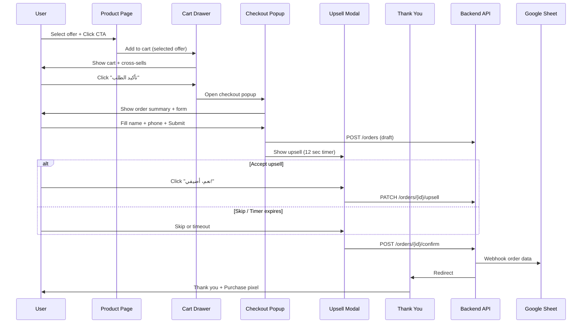

# Checkout & Cart Flow — GUMÜÇROYAL

## Flow complet



---

## Cart Drawer

### Behavior
- Opens from right (RTL: from left/start side)
- Overlay backdrop dark 50%
- Slide animation 300ms
- Close: X button, backdrop click, Escape key
- Persists in localStorage (Zustand persist)
- Badge count on header cart icon

### Structure

```
┌──────────────────────────────────────┐
│  🛒 سلتك                      [✕]   │
│  ────────────────────────────────── │
│                                      │
│  [img] خاتم الرابط الأبدي          │
│        عرض زوجي x2                   │
│        429 د.م.              [🗑]   │
│                                      │
│  ────────────────────────────────── │
│  💡 زبائن اشترو كذلك:               │
│  ┌──────────┐  ┌──────────┐         │
│  │ [img]    │  │ [img]    │         │
│  │ Collier  │  │ Bague    │         │
│  │ 279 د.م. │  │ 229 د.م. │         │
│  │ [+ أضف]  │  │ [+ أضف]  │         │
│  └──────────┘  └──────────┘         │
│                                      │
│  ────────────────────────────────── │
│  ✓ توصيل مجاني f ga3 l'maghrib     │
│  ★★★★★ 4.9 — +2,847 client satisfait│
│                                      │
│  المجموع: 429 د.م.                  │
│                                      │
│  [     تأكيد الطلب — COD     ]      │
│                                      │
└──────────────────────────────────────┘
```

### Cross-sell logic
```typescript
function getCrossSells(cartProductIds: string[]): Product[] {
  const ALL_PRODUCTS = ['bague-lien-eternel', 'collier-trefle-lumiere', 'bague-double-signature'];
  return ALL_PRODUCTS
    .filter(id => !cartProductIds.includes(id))
    .map(id => getProduct(id));
}
```

Cross-sell add = single offer, quantity 1.

### Empty cart
- Message: "سلتك فارغة"
- CTA: "اكتشفي مجموعتنا" → `/collection`

---

## Checkout Popup

### Trigger
Cart drawer "تأكيد الطلب" button → opens checkout popup (modal center screen)

### Structure

```
┌─────────────────────────────────────────────┐
│  ✕                                          │
│  ─────────────────────────────────────────  │
│  📋 ملخص الطلب                              │
│  ─────────────────────────────────────────  │
│  Bague Lien Éternel x2         429 د.م.    │
│  ─────────────────────────────────────────  │
│  المجموع:                       429 د.م.    │
│  ✓ توصيل مجاني | ✓ COD                     │
│  ─────────────────────────────────────────  │
│  ★★★★★ "وصلني f 2 jours!" — سارة, Casa     │
│  ─────────────────────────────────────────  │
│  ⏱️ Commande daba = livraison jeudi        │
│  ─────────────────────────────────────────  │
│                                             │
│  📝 معلومات التوصيل                         │
│                                             │
│  الاسم الكامل *                             │
│  ┌─────────────────────────────────────┐     │
│  │                                     │     │
│  └─────────────────────────────────────┘     │
│                                             │
│  رقم الهاتف *                               │
│  ┌─────────────────────────────────────┐     │
│  │  06 XX XX XX XX                     │     │
│  └─────────────────────────────────────┘     │
│  📱 رقم مغربي (06 أو 07) فقط               │
│                                             │
│  [   ✅ تأكيد الطلب — الدفع عند الاستلام  ] │
│                                             │
│  🔒 بياناتك آمنة — ma kanpartagiwch       │
└─────────────────────────────────────────────┘
```

### Form validation

**Name:**
- Required, min 2 chars, max 100
- Arabic/Latin chars allowed
- Trim whitespace

**Phone (Morocco ONLY):**
```typescript
// Frontend validation
const MOROCCO_PHONE_REGEX = /^(?:0|\+212|212)?[67]\d{8}$/;

function validateMoroccoPhone(input: string): { valid: boolean; normalized: string; error?: string } {
  const cleaned = input.replace(/[\s\-\(\)\.]/g, '');
  
  // Accept: 0612345678, +212612345678, 212612345678
  if (/^0[67]\d{8}$/.test(cleaned)) {
    return { valid: true, normalized: `212${cleaned.slice(1)}` };
  }
  if (/^\+212[67]\d{8}$/.test(cleaned)) {
    return { valid: true, normalized: cleaned.slice(1) }; // remove +
  }
  if (/^212[67]\d{8}$/.test(cleaned)) {
    return { valid: true, normalized: cleaned };
  }
  
  return { valid: false, normalized: '', error: 'رقم الهاتف غير صالح. استعملي 06 أو 07.' };
}
```

```python
# Backend validation (identical logic)
import re

MOROCCO_PHONE_PATTERN = re.compile(r'^(?:0|\+?212)?([67]\d{8})$')

def normalize_morocco_phone(phone: str) -> str | None:
    cleaned = re.sub(r'[\s\-\(\)\.]', '', phone.strip())
    match = MOROCCO_PHONE_PATTERN.match(cleaned)
    if not match:
        return None
    digits = match.group(1)
    return f"212{digits}"
```

**Display format:** Show user input as `06 XX XX XX XX` with auto-formatting.

### Submit behavior
1. Validate form client-side
2. Fire `InitiateCheckout` pixel (if not already)
3. Fire `AddPaymentInfo` pixel on valid form
4. POST `/api/orders` → create draft order
5. Close checkout popup
6. Open upsell modal
7. Fire pixels via backend CAPI simultaneously

---

## Upsell Modal (10-15 seconds)

### Config
```typescript
const UPSELL_CONFIG = {
  durationSeconds: 12, // configurable 10-15
  price: 69, // MAD — ONLY discount on site
  currency: 'MAD',
};
```

### Timer behavior
- Progress bar countdown visual
- At 0: auto-skip → confirm order without upsell
- "لا شكراً" = immediate skip
- "نعم، أضيفي!" = add upsell product at 69 MAD

### Upsell product selection
```typescript
function getUpsellProduct(cartItems: CartItem[]): Product {
  const orderedIds = cartItems.map(i => i.productId);
  const UPSELL_MAP: Record<string, string> = {
    'bague-lien-eternel': 'collier-trefle-lumiere',
    'collier-trefle-lumiere': 'bague-lien-eternel',
    'bague-double-signature': 'collier-trefle-lumiere',
  };
  const mainProduct = cartItems[0].productId;
  const upsellId = UPSELL_MAP[mainProduct] || 'collier-trefle-lumiere';
  // Return if not already in cart, else next available
  if (orderedIds.includes(upsellId)) {
    return getFirstNotInCart(orderedIds);
  }
  return getProduct(upsellId);
}
```

### After upsell (accept or skip)
1. PATCH order with upsell decision
2. POST `/api/orders/{id}/confirm`
3. Backend: save to DB + send to Google Sheet + fire CAPI Purchase
4. Redirect to `/thank-you/{orderId}`
5. Fire browser Purchase pixel with same `event_id`

---

## Thank You Page

- Display order summary
- Order ID format: `GR-YYYYMMDD-XXXX`
- Message confirmation COD
- WhatsApp link for questions
- Purchase pixel + all CAPI events
- No further upsells

---

## Order ID Generation

```python
# Backend
from datetime import datetime
import random

def generate_order_id(db_session) -> str:
    date_part = datetime.utcnow().strftime('%Y%m%d')
    seq = random.randint(1000, 9999)  # or DB sequence
    return f"GR-{date_part}-{seq:04d}"
```

---

## State Management (Frontend)

Use **Zustand** with persist:

```typescript
interface CartStore {
  items: CartItem[];
  addItem: (productId: string, offerId: string) => void;
  removeItem: (itemId: string) => void;
  clearCart: () => void;
  getTotal: () => number;
  getCrossSells: () => Product[];
}
```

Separate stores/modals:
- `useCartStore` — cart items
- `useUIStore` — drawer open, checkout open, upsell open

---

## Error Handling

| Error | User message (AR) | Action |
|-------|-------------------|--------|
| Invalid phone | رقم الهاتف غير صالح | Highlight field |
| Empty name | الاسم مطلوب | Highlight field |
| API error | وقع خطأ، عاودي من فضلك | Retry button |
| Network | تحققي من الاتصال | Retry button |

Never lose cart data on error.
